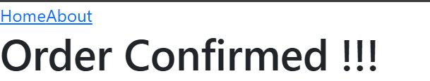
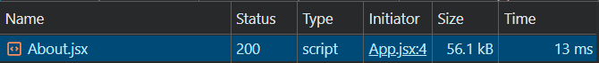
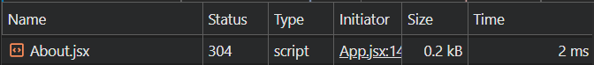

<h1 align="center">
   React Router
</h1>

---

## ==Lesson 1 - Introduction==

#### What is React Router ?

It is a fully-featured client-side and server-side routing library for React.

Helps create and navigate between different URLs that make up your web application.  
Provides unique URLs for different components in the app and makes the UI easily sharable with other users.

##### Table of Contents

1. [Introduction](#lesson-1---introduction)
2. [Installation](#lesson-2---installation-and-setup)
3. [Configuring Route](#lesson-3---configuring-route)
4. [Links](#lesson-4---links)
5. [Active Links](#lesson-5---active-links)
6. [Navigate Programmatically](#lesson-6---navigate-programmatically)
7. [No Match Route](#lesson-7---no-match-route)
8. [Nested Routes](#lesson-8---nested-routes)
9. [Index Route](#lesson-9---index-route)
10. [Dynamic Route](#lesson-10---dynamic-route)
11. [URL Params](#lesson-11---url-params)
12. [Search Params](#lesson-12---search-params)
13. [Relative Links](#lesson-13---relative-links)
14. [Lazy Loading](#lesson-14---lazy-loading)
15. [Authentication](#lesson-15---authentication)
16. [Loader](#lesson-16---loader)
17. [Error Element](#lesson---17-error-element)
18. [useLocation Hook](#lesson-18---uselocation-hook)
19. [Forms & Action](#lesson-19---forms--action)

## ==Lesson 2 - Installation and Setup==

1. Create a react app `npm create vite@latest .`
2. Install react router package `npm i react-router-dom`

Read More 👉 <https://reactrouter.com/start/framework/installation>

## ==Lesson 3 - Configuring Route==

**Scenario**
When visit `localhost:3000 `-> It will visit home page
When visit `localhost:3000/about` -> It will visit about page

#### Step 1: `import { BrowserRouter } from "react-router-dom"` and wrap it to `<App/>` component.

```jsx
createRoot(document.getElementById("root")).render(
  <StrictMode>
    <BrowserRouter>
      <App />
    </BrowserRouter>
  </StrictMode>
);
```

#### Step 2: Handle `"/"` and `"/about"` url

```jsx
export default function App() {
  return (
    <Routes>
      <Route path="/" element={<Home />} />
      // <Route index element={<Home />} /> both are same
      <Route path="/about" element={<About />} />
    </Routes>
  );
}
```

**_There is another modern way of configure route_**

```jsx
import { createBrowserRouter, RouterProvider } from "react-router-dom";
import Home from "./Home";
import About from "./About";

const router = createBrowserRouter([
  {
    path: "/",
    element: <Home />,
  },
  {
    path: "/about",
    element: <About />,
  },
]);

export default function App() {
  return <RouterProvider router={router} />;
}
```

**✅ Pros:**

- Powerful and scalable.
- Great for large apps needing data fetching with routing.
- Cleaner nested routing and error handling.
- Declarative logic and configuration.

Read More 👉 <https://reactrouter.com/start/data/routing#configuring-routes>

## ==Lesson 4 - Links==

**Scenario:** In navbar there will two link `Home` and `About`, how to navigate to the particular route when button clicked

`Navbar.jsx`

```jsx
export default function Navbar() {
  return (
    <nav>
      <Link to={"/"}>Home</Link>
      <Link to={"/about"}>About</Link>
    </nav>
  );
}
```

`App.jsx`

```jsx
export default function App() {
  return (
    <>
      <Navbar />
      <Routes>
        <Route path="/" element={<Home />} />
        <Route path="/about" element={<About />} />
      </Routes>
    </>
  );
}
```

Read More 👉 <https://reactrouter.com/api/components/Link>

## ==Lesson 5 - Active Links==

It is important to show user in which page user currently in. For that react router router provide `NavLink`  
By deafault it receives an active class, when the links is in current route

```jsx
export default function Navbar() {
  return (
    <nav>
      <NavLink to={"/"}>Home</NavLink>
      <NavLink to={"/about"}>About</NavLink>
    </nav>
  );
}
```

now you can add styling to active class

```css
nav a.active {
  text-decoration: none;
  font-weight: bold;
}
```


Based on link active or not we can set styling

```jsx
export default function Navbar() {
  const navLinkStyle = ({ isActive }) => {
    return {
      fontWeight: isActive ? "bold" : "normal",
      textDecoration: isActive ? "none" : "underline",
    };
  };
  return (
    <nav>
      <NavLink to={"/"} style={navLinkStyle}>
        Home
      </NavLink>
      <NavLink to={"/about"} style={navLinkStyle}>
        About
      </NavLink>
    </nav>
  );
}
```

navLink is useful while building navbar or any breadcrume

Read More 👉 <https://reactrouter.com/api/components/NavLink#navlink>

## ==Lesson 6 - Navigate Programmatically==

Instead of navigate through button (user does), it is become essential to navigate programmatically. Like after placing order in amazon navigate to payment page or after login navigate to home page  
**Scenario:** From home page we have to go to `/payment-portal` page

#### 1.`useNavigate()` (hook)

**Step 1:** Define the react component

```jsx
export default function PaymentPortalPage() {
  return <h1>Order Confirmed !!!</h1>;
}
```

**Step 2:** Add route handler

```jsx
<Routes>
  <Route path="/" element={<Home />} />
  <Route path="/about" element={<About />} />
  <Route path="/payment-portal" element={<PaymentPortalPage />} />
</Routes>
```

**Step 3:** Programmatically navigate

```jsx
import { useNavigate } from "react-router-dom";

export default function Home() {
  const navigate = useNavigate();
  function handleOnClick() {
    navigate("/payment-portal");
  }
  return (
    <>
      <h1>Home Page</h1>
      <button className="btn btn-primary" onClick={handleOnClick}>
        Place Order
      </button>
    </>
  );
}
```

 

`useNavigate` is a react router hook that helps us to navigate. Inside the navigate function what path we pass it will go to that particulat route.

**Scenario:2** If you want to go back from `payment-poratl` to `/`

```jsx
import { useNavigate } from "react-router-dom";

export default function PaymentPortalPage() {
  const navigate = useNavigate();

  return (
    <>
      <h1>Order Confirmed !!!</h1>
      <button className="btn btn-secondary" onClick={() => navigate(-1)}>
        Go Back
      </button>
    </>
  );
}
```

**Scenario:3** Instead of returing to the previous page replace history stack

```jsx
export default function Home() {
  const navigate = useNavigate();
  function handleOnClick() {
    navigate("/payment-portal", { replace: true });
  }
  return (
    <>
      <h1>Home Page</h1>
      <button className="btn btn-primary" onClick={handleOnClick}>
        Place Order
      </button>
    </>
  );
}
```

✅ Good for user interaction
❌ Cannot be used in loaders or actions
✅ Works with dynamic routes, replaces history if `navigate("/x", { replace: true })`

Read More 👉 <https://reactrouter.com/api/hooks/useLocation#uselocation>

#### 2 `<Navigate to="/path" />` (component)

**When to use:** During render — when you want to redirect based on a condition (e.g., user not logged in).

```jsx
import { Navigate } from "react-router-dom";

function Dashboard({ isLoggedIn }) {
  if (!isLoggedIn) {
    return <Navigate to="/login" replace />;
  }

  return <h1>Welcome to Dashboard</h1>;
}
```

✅ Can conditionally render based on props/state
✅ Good for protected routes / auto-redirects
❌ Can’t be used inside loader() or action()
✅ Controlled via component logic

Read more 👉 <https://reactrouter.com/api/components/Navigate>

#### 3. `redirect()` (inside loaders/actions)

**When to use:** In a loader or action function to redirect before rendering or after a form submission.

🔸Example (in action):

```jsx
import { redirect } from "react-router-dom";

export async function loginAction({ request }) {
  const formData = await request.formData();
  const username = formData.get("username");

  const isValid = await checkLogin(username);

  if (isValid) {
    return redirect("/dashboard"); // 👈 this changes the route
  } else {
    throw new Error("Login failed");
  }
}
```

✅ Works before render
✅ Only valid inside loader or action
✅ Triggers full routing logic (loaders, actions, etc.)
❌ Not usable in components or event handlers

```jsx
import { redirect } from "react-router-dom";

export default function Home() {
  return (
    <>
      <h1>Home Page</h1>
      <button
        className="btn btn-primary"
        onClick={() => redirect("/payment-portal")}
      >
        Place Order
      </button>
    </>
  );
}
```

The redirect() function from react-router-dom:

- does not actually perform navigation inside components.
- It is only meant to be used inside loader() or action() functions as part of route configuration.

Read More 👉 <https://reactrouter.com/api/utils/redirect>

So in your code, calling redirect() just returns a special response object — it doesn't do anything to the browser history.

###### 🔁 Summary Table

| Feature                     | `useNavigate()`              | `<Navigate />`   | `redirect()` (in loader/action) |
| --------------------------- | ---------------------------- | ---------------- | ------------------------------- |
| Where to use                | In components                | In JSX return    | In loaders/actions              |
| Triggered by                | Event handlers (e.g., click) | Render condition | Loader or form logic            |
| Navigation timing           | After interaction            | During render    | Before render                   |
| Can be conditional?         | ✅ Yes                       | ✅ Yes           | ✅ Yes                          |
| Works in `loader`/`action`? | ❌ No                        | ❌ No            | ✅ Yes                          |
| Triggers route loaders?     | ✅ Yes                       | ✅ Yes           | ✅ Yes                          |
| History options (`replace`) | ✅ Yes                       | ✅ Yes           | ✅ Implicit                     |

##### 🧠 When to Use What?

| Use Case                              | Best Option                       |
| ------------------------------------- | --------------------------------- |
| Button or user click navigation       | `useNavigate()`                   |
| Redirect after login inside action    | `redirect()`                      |
| Protect a route during render         | `<Navigate />`                    |
| Redirect after a form (`<Form>`) post | `redirect()`                      |
| Navigate based on state change        | `<Navigate />` or `useNavigate()` |

## ==Lesson 7 - No Match Route==

If user go to a page that does't exist, then what happen it will give a error. So we have to send 404 - Page not found to user

How to configure a no match route

**Step - 1** Define a Not Found Page

```jsx
export default function NotFoundPage() {
  return <h1>404 - Page Not Found</h1>;
}
```

**Step - 2** Handle a route that does't match any path

```jsx
<Routes>
  <Route path="/" element={<Home />} />
  <Route path="/about" element={<About />} />
  <Route path="/payment-portal" element={<PaymentPortalPage />} />
  <Route path="*" element={<NotFoundPage />} />
</Routes>
```

```jsx
<Route path="*" element={<NotFoundPage />} />
```

`*` This have a special meaning in react router. It will only match when other don't

## ==Lesson 8 - Nested Routes==

**Scenario:** We have a products page, there is two option upon clicking to feature button will we navigate to `/products/features` and upon clicking to new button we will navigate to `/products/new`

#### Step 1: Define components

```jsx
import { Link, Outlet } from "react-router-dom";

export default function ProductPage() {
  return (
    <>
      <h1>Product Page</h1>
      <Link to={"features"}>Feature</Link>
      <Link to={"new"}>New</Link>
      <Outlet />
    </>
  );
}
```

Don't add `/feature` or `/new`, then it will go to `localhost:3000/features` and `localhost:3000/new`

`Outlet is a the shared layout where feature or new will load`

```jsx
export default function FeatureProduct() {
  return <h1>List of all feature products</h1>;
}
```

#### Step 2: Add nested route

```jsx
<Routes>
  <Route path="/" element={<Home />} />
  <Route path="/products" element={<ProductPage />}>
    <Route path="features" element={<FeatureProducts />} />
    <Route path="new" element={<NewProduct />} />
  </Route>
  <Route path="*" element={<NotFoundPage />} />
</Routes>
```

or

```jsx
import { createBrowserRouter, RouterProvider } from "react-router-dom";
import Home from "./Home";
import About from "./About";

const router = createBrowserRouter([
  {
    path: "/",
    element: <Home />,
  },
  {
    path: "products",
    element: <ProductsPage />,
    children: [
      {
        path: "features",
        element: <Feature />,
      },
      {
        path: "new",
        element: <New />,
      },
    ],
  },
  {
    path: "/about",
    element: <About />,
  },
]);

export default function App() {
  return <RouterProvider router={router} />;
}
```

Read More 👉 <https://reactrouter.com/start/data/routing#nested-routes>

## ==Lesson 9 - Index Route==

Sometime you want that child route will render at parent level

**Scenario:** In `localhost:3000/products/features` it will load the `Feature` components and `localhost:3000/products/new` it will load the `new` components. But I want on `localhost:3000/products` it will render the `feature` components also

```jsx
<Routes>
  <Route path="/products" element={<ProductPage />}>
    <Route index element={<FeatureProduct />} />
    <Route path="features" element={<FeatureProduct />} />
    <Route path="new" element={<NewProduct />} />
  </Route>
</Routes>
```

> `<Route index element={<FeatureProduct />} />` element is `<FeatureProduct/>` as we want to load feature products in `/products`

or

```jsx
const router = createBrowserRouter([
  {
    path: "/",
    element: <Home />,
  },
  {
    path: "products",
    element: <ProductsPage />,
    children: [
      {
        index: true, // 👈 This makes <Feature /> the default child
        element: <Feature />,
      },
      {
        path: "features",
        element: <Feature />,
      },
      {
        path: "new",
        element: <New />,
      },
    ],
  },
  {
    path: "/about",
    element: <About />,
  },
]);
```

##### 📦 Don't Forget:

Your `ProductsPage` component must include an `<Outlet />` to render nested routes:

```jsx
import { Outlet } from "react-router-dom";

export default function ProductsPage() {
  return (
    <div>
      <h1>Products Page</h1>
      <Link to={"features"}>Feature</Link>
      <Link to={"new"}>New</Link>
      <Outlet /> {/* 👈 This is where <Feature /> or <New /> will be rendered */}
    </div>
  );
}
```

## ==Lesson 10 - Dynamic Route==

**Scenario:** What happen when we have to show details of individual element

`localhost:3000/users` -> will show deatils of all users
`localhost:3000/users/id` -> will show deatils of that particular users.

##### Step 1: Define all the components

```jsx
export default function UsersPage() {
  return (
    <>
      <h1>Details of all users</h1>
      <div>
        <p>User 1</p>
        <p>User 2</p>
        <p>User 3</p>
      </div>
    </>
  );
}
```

```jsx
export default function UserDetails() {
  return (
    <>
      <h1>Details Of user</h1>
      <div>
        {/* User details will be fetch from db */}
        <p>Name: Name</p>
        <p>Title: Title</p>
      </div>
    </>
  );
}
```

##### Step 2: Configure the dynamic route

```jsx
const router = createBrowserRouter([
  {
    path: "/",
    element: <Main />,
    children: [
      {
        path: "/",
        element: <Home />,
      },
      {
        path: "users",
        element: <UsersPage />,
      },
      {
        path: "users/:id",
        element: <UserDetails />,
      },
    ],
  },
]);
```

`:id` `(:)` tells that it will be dynamic path,  
 `/users/1` will load users 1 details `/users/2` will load user 2 details and so on

`id` is string.
If I pass `id = admin`, then which page it will render admin page or admin details ?

```jsx
const router = createBrowserRouter([
  {
    path: "/",
    element: <Main />,
    children: [
      {
        path: "/",
        element: <Home />,
      },
      {
        path: "users",
        element: <UsersPage />,
      },
      {
        path: "users/:id",
        element: <UserDeatails />,
      },
      {
        path: "users/admin",
        element: <AdminPage />,
      },
    ],
  },
]);
```

Answer is `AdminPage`.  
Why -> `React Router` first find specific path, then go for dynamic path

## ==Lesson 11 - URL Params==

In an application you want to extract `userId` from url, and do something with that id, may be some db call and show user details

To extract route parameter we need a hook called `useParams()`

```jsx
import { useParams } from "react-router-dom";

export default function UserDeatails() {
  const params = useParams();
  const userId = params.id;
  return (
    <>
      <h1>Deatails Of user: {userId}</h1>
    </>
  );
}
```

`params.id` refer to this ->

```jsx
{
path: "users/:id",
element: <UserDeatails />,
}
```

🌟 name should be same otherwise will get an error

Read More 👉 <https://reactrouter.com/start/declarative/url-values#route-params>

## ==Lesson 12 - Search Params==

url parmas is not the only way to add paramter to the route, we can also add a `optional(?)` query string
For example: `localhost:3000/users/?filter=active`

**Scenario:** `localhost:3000/users` will load all users and `localhost:3000/users/?filter=active` will load only the active user

```jsx
import { useSearchParams } from "react-router-dom";

export default function UsersPage() {
  const [searchParams, setSearchParams] = useSearchParams(); // setSearchParams can add or remove the parameter

  return (
    <>
      <div>
        {/* This will set the url `localhost:3000/users/?filter=active` */}
        <button onClick={() => setSearchParams({ filter: "active" })}>
          Active Users
        </button>
        {/* It will remove the query params means set to empty object */}
        <button onClick={() => setSearchParams({})}>Reset Filter</button>
      </div>
    </>
  );
}
```

```jsx
import { useSearchParams } from "react-router-dom";
const [searchParams, setSearchParams] = useSearchParams(); // setSearchParams can add or remove the parameter
const showActiveUsers = searchParams.get("filter") === "active";

export default function UsersPage() {
  return (
    <>
      <div>
        {/* This will set the url => `localhost:3000/users/?filter=active` */}
        <button onClick={() => setSearchParams({ filter: "active" })}>
          Active Users
        </button>
        {/* It will remove the query params means set to empty object */}
        <button onClick={() => setSearchParams({})}>Reset Filter</button>
      </div>
      {!showActiveUsers ? (
        <h2>Details of all users</h2>
      ) : (
        <h2>Showing only active users</h2>
      )}
    </>
  );
}
```

Read More 👉 <https://reactrouter.com/api/hooks/useSearchParams>

## ==Lesson 13 - Relative Links==

A relative link is a link that does't start with `/` and inherit the closest route in which they are rendered

App.jsx

```jsx
{
  path: "/products",
  element: <ProductsPage />,
  children: [
    {
      path: "features",
      element: <Feature />,
    },
    {
      path: "new",
      element: <New />,
    },
  ],
},
```

ProductsPage.jsx

```jsx
export default function ProductsPage() {
  return (
    <>
      <h1>Product Page</h1>
      <Link to={"features"}>Feature</Link>
      <Link to={"new"}>New</Link>
      {/* <Outlet /> */}
    </>
  );
}
```

As `feature` and `new` are inside `ProductsPage` and there is no `/` it will go to relative path -> `products/features` and `products/new`  
But if there was a ralative path

```jsx
export default function ProductsPage() {
  return (
    <>
      <h1>Product Page</h1>
      <Link to={"/features"}>Feature</Link>
      <Link to={"/new"}>New</Link>
      {/* <Outlet /> */}
    </>
  );
}
```

It will go to `localhost:3000/features` and `localhost:3000/new`
To solve the problem remove the `/` or make it absolute path

```jsx
export default function ProductsPage() {
  return (
    <>
      <h1>Product Page</h1>
      <Link to={"products/features"}>Feature</Link>
      <Link to={"products/new"}>New</Link>
      {/* <Outlet /> */}
    </>
  );
}
```

Either is fine

## ==Lesson 14 - Lazy Loading==

Lazy loading is a technique where components not required on the go. Page can be split into separate code bundle can and downloaded only when user navigates to that page, you can think of it as incrementally downloading the application. It helps reduces initilal load time thereby improving performance.

**Step 1:** Make a react component bulky

```jsx
export default function About() {
  return (
    <>
      <h1>AboutPage</h1>
      // add lorem * 20
      <div>
        Lorem ipsum dolor sit amet, consectetur adipiscing elit. Fusce cursus
      </div>
    </>
  );
}
```


Component size is 56 kb and take 13ms to render.

**Step 2:** Move your import statement to a lazy components, and pass it to the route

```jsx
const LazyAbout = React.lazy(() => import("./pages/About"));
```

Now instead of `<About/>` it will be `<LazyAbout/>`

```jsx
{
  path: "about",
  element: <LazyAbout />,
}
```

A promised-based component is return by this dynamic import, which is converted into a module that contain default exported react component, which is our `About component`


Loading time has reduced to from 13ms to 2ms, but still it has issue. It will give a run time error.
Error -> `Uncaught Error: A React component suspended while rendering, but no fallback UI was specified.`

**Step 3:** ✅ Wrap Lazy Components with `<Suspense>`

```jsx
{
path: "about",
element: (
  <Suspense fallback={<div>Loading About Page...</div>}>
    <LazyAbout />
  </Suspense>
),
},
```

##### If You Didn't See the Error Clearly

- React doesn’t throw a compile-time error — because it’s valid JS.
- It throws at runtime, but if no error boundary or dev tooling catches it, you just get a blank UI.
- If you’re using a custom error page (errorElement) — the fallback may silently catch it.

Wrap with a Custom Error Boundary (Optional). If you want full control over lazy-load errors:

```jsx
<Suspense fallback={<LoadingSpinner />}>
  <ErrorBoundary>
    <LazyAbout />
  </ErrorBoundary>
</Suspense>
```

> 💡 Each lazy() + Suspense introduces a new JavaScript chunk and network request.

### 📊 When to Use Lazy Loading

| Use Case                                   | Should You Lazy Load? |
| ------------------------------------------ | --------------------- |
| Full page routes                           | ✅ Yes                |
| Large feature-specific components          | ✅ Yes                |
| Modals, editors, or optional popups        | ✅ Yes                |
| Reusable small components (`<Button>`)     | ❌ No                 |
| Layout components (`<Header>`, `<Footer>`) | ❌ No                 |

Read More 👉 <https://reactrouter.com/explanation/lazy-route-discovery#lazy-route-discovery>

## ==Lesson 15 - Authentication==

When building any application it is important to protect most routes. Like Landing page, signin page, signup page will be publically accessible, and rest will be protected routes.

**Scenario:** `Profile` page will be protected, if user is not login page will show a login page. After login it will show the user name

**Step 1:** Build a profile components

```jsx
export default function ProfilePage() {
  return (
    <>
      <h1>Profile Page</h1>
    </>
  );
}
```

For maintaning user is logged in or not we need a state variable, and passed it to the component tree (we will use context API)

1. Creating a context API

```jsx
import { createContext, useContext, useState } from "react";

const AuthContext = createContext(null);

export default function AuthProvider({ children }) {
  cosnst[(user, setUser)] = useState(null);
  const login = (user) => setUser(user);
  const logout = () => setUser(null);
  return (
    <AuthContext.Provider value={{ user, login, logout }}>
      {children}
    </AuthContext.Provider>
  );
}

export const useAuth = () => {
  return useContext(AuthContext);
};
```

2. Add the context at the top.

```jsx
export default function App() {
  return (
    <AuthProvider>
      <RouterProvider router={router} />;
    </AuthProvider>
  );
}
```

3. Implement a login route

```jsx
import { useRef } from "react";
import { useAuth } from "./Auth";
import { useNavigate } from "react-router-dom";

export default function Login() {
  const userNameRef = useRef();
  const navigate = useNavigate();
  const auth = useAuth();
  function handleLogin() {
    const user = userNameRef.current.value;
    auth.login(user);
    navigate("/profile");
  }

  return (
    <>
      <label>
        UserName
        <input type="text" ref={userNameRef} />
      </label>
      <button onClick={handleLogin}>Login</button>
    </>
  );
}
```

4. Configure login route

```jsx
 {
path: "login",
element: <Login />,
},
```

5. Add a login button to navbar

```jsx
import { NavLink } from "react-router-dom";
import { useAuth } from "./Auth";

export default function Navbar() {
  const auth = useAuth();
  return (
    <nav>
      <NavLink to={"/"}>Home</NavLink>
      <NavLink to={"/about"}>About</NavLink>
      {auth.user ? (
        <NavLink to={"profile"}>Profile</NavLink>
      ) : (
        <NavLink to={"login"}>Login</NavLink>
      )}
    </nav>
  );
}
```

5. Show user details in profile page if user is logged in (profile page is protected route)

```jsx
import { useNavigate } from "react-router-dom";
import { useAuth } from "../utlis/Auth";

export default function ProfilePage() {
  const auth = useAuth();
  const navigate = useNavigate();
  function handleLogout() {
    auth.logout();
    navigate("/");
  }
  return (
    <>
      <h1>Profile Page</h1>
      <div>Welcome: {auth.user}</div>
      <button onClick={handleLogout}>Log Out</button>
    </>
  );
}
```

> Problem -> `/profile` is not protected, Let's protect this page

Protecting a route will be a reusable code, in future you might protect another route

6. Protect a route by makeing a wrapper components

```jsx
import { Navigate } from "react-router-dom";
import { useAuth } from "../utlis/Auth";

export default function RequireAuth({ children }) {
  const auth = useAuth();
  if (!auth.user) {
    return <Navigate to={"/login"} />;
  }
  return children;
}
```

7. Protect the particular route

```jsx
{
  path: "profile",
  element: (
    <RequireAuth>
      <ProfilePage />
    </RequireAuth>
  ),
}
```

## ==Lesson 16 - Loader==

**📦 What is a React Router loader?**

A loader in React Router DOM v6.4+ is a special function used to fetch data before rendering a route component. It lets you load data on a per-route basis, and the route will wait for the data before rendering.

**In simple words:**
It’s like `useEffect + fetch`, but at the routing level, not inside the component.

### Example: Without Loader (Traditional way)

`userPage.jsx`

```jsx
function UserPage() {
  const [user, setUser] = useState(null);
  useEffect(() => {
    fetch("/api/user/1")
      .then((res) => res.json())
      .then(setUser);
  }, []);
  if (!user) return <p>Loading...</p>;
  return <h1>{user.name}</h1>;
}
```

- ❌ `useEffect()` runs after render → blank UI for a moment
- ❌ Manual loading state handling

### Same Example: With Loader

`router.jsx`

```jsx
import { createBrowserRouter } from "react-router-dom";
import UserPage, { userLoader } from "./pages/UserPage";

const router = createBrowserRouter([
  {
    path: "/user",
    element: <UserPage />,
    loader: userLoader,
  },
]);
```

`userPage.jsx`

```jsx
import { useLoaderData } from "react-router-dom";

export function userLoader() {
  return fetch("/api/user/1").then((res) => res.json());
}

export default function UserPage() {
  const user = useLoaderData(); // what promise you return from loader, it will resolve and save to variable
  return <h1>{user.name}</h1>;
}
```

### 🚦 React Router Loader vs Manual Data Fetching

| Feature                                    | Without Loader                       | With Loader                              |
| ------------------------------------------ | ------------------------------------ | ---------------------------------------- |
| **Fetch Timing**                           | After component renders              | ✅ Before component renders              |
| **UI Experience**                          | Shows empty screen or spinner first  | ✅ Route waits for data before rendering |
| **Loading screen needed?**                 | ✅ Yes                               | Optional (can use `<Suspense>`)          |
| **Error Handling**                         | Manual `try/catch` in `useEffect`    | ✅ Built-in error boundary support       |
| **Data Co-location**                       | ❌ Logic is scattered in components  | ✅ Centralized in route config           |
| **Works with `defer()` & streaming**       | ❌ No                                | ✅ Yes, great for progressive loading    |
| **Server-side Rendering (SSR)**            | ❌ Hard to optimize                  | ✅ Friendly to SSR and streaming         |
| **Code Readability & Structure**           | 👎 Messy with async hooks everywhere | ✅ Clean, declarative in router config   |
| **Integration with Actions (forms, etc.)** | ❌ Manual form handling              | ✅ Works with loader + action together   |
| **When to Use**                            | Small components, shared UI          | ✅ Route-level data fetching needs       |

> In the loader function, how is { params } available? if not passing as props

`CareerDetail.jsx`

```jsx
import { useLoaderData } from "react-router-dom";

export default function CareerDetail() {
  const career = useLoaderData();

  return (
    <>
      <h2>This is carrer Page</h2>
      <div>
        {career.title}
        {career.salary}
      </div>
    </>
  );
}
export const careerDeatailLoader = ({ params }) => {
  // how params is comming, although not passing as props
  const { id } = params;
  return fetch("https://localhost:3000/carrers/" + id);
};
```

`router.jsx`

```jsx
{
  path: "careers/:id",
  element: <CareerDetail />,
  loader: careerDetailLoader,
}
```

**✅ Short Answer**
React Router automatically injects `params`, `request`, and `context` into your `loader` function — based on the URL pattern you define in your route.
You don’t have to manually pass them.

React Router sees the `:id` parameter and ensures that `params.id` is available when it calls your `loader()`.
So when someone visits `/careers/3`, the router will call:

```jsx
careerDetailLoader({ params: { id: "3" }, request, context });
```

**This gets auto-called by React Router when `/career/:id` is visited**

```jsx
export const careerDetailLoader = ({ params }) => {
  const { id } = params; // ✅ "id" from the URL
  return fetch("https://localhost:3000/carrers/" + id);
};
```

**What React Router passes to a loader**
Every loader receives this object:

```ts
type LoaderFunctionArgs = {
  params: Params<string>;
  request: Request;
  context: any;
};
```

**You can destructure like this:**

```js
export function loader({ params, request, context }) {
  // params.id, request.method, etc.
}
```

Read More 👉 <https://reactrouter.com/start/framework/data-loading>

## ==Lesson - 17 Error Element==

#### 🧩 What is `errorElement` in React Router?

`errorElement` is used to handle route-specific runtime errors, such as:

- Loader errors (e.g., failed fetch)
- Action errors (e.g., form submission fails)
- Navigation to a broken or rejected route
- Any thrown error during route rendering

##### 🛑 It acts like a `catch` block for the route it’s defined on.

No — these two are different:

| Type                  | Purpose                         | Triggered When...                               |
| --------------------- | ------------------------------- | ----------------------------------------------- |
| `404 Not Found` route | Handles unmatched paths         | URL doesn't match any defined route             |
| `errorElement`        | Handles runtime errors in route | Loader, action, or render function throws error |

#### 🎯 Why use errorElement?

- Centralized error display per route
- Graceful UX when loaders fail
- You don’t need to manually use try/catch
- It integrates with route structure

`CarrerDetail.jsx`

```jsx
import { useLoaderData } from "react-router-dom";

export async function careerDetailLoader({ params }) {
  const res = await fetch(`https://example.com/careers/${params.id}`);
  if (!res.ok) {
    throw new Error("Career not found");
  }
  return res.json();
}

export default function CareerDetail() {
  const career = useLoaderData();
  return (
    <div>
      <h2>{career.title}</h2>
      <p>Salary: {career.salary}</p>
    </div>
  );
}
```

`router.jsx`

```jsx
import { createBrowserRouter } from "react-router-dom";
import CareerDetail, { careerDetailLoader } from "./pages/CareerDetail";
import ErrorPage from "./components/ErrorPage";

const router = createBrowserRouter([
  {
    path: "/career/:id",
    element: <CareerDetail />,
    loader: careerDetailLoader,
    errorElement: <ErrorPage />, // 👈 catches any error in loader
  },
  {
    path: "*",
    element: <NotFoundPage />, // 👈 handles 404 only
  },
]);
```

`ErrorPage`

```jsx
import { useRouteError } from "react-router-dom";

export default function ErrorPage() {
  const error = useRouteError();
  return (
    <div>
      <h2>Oops! Something went wrong.</h2>
      <p>{error.message || "Unknown error"}</p>
    </div>
  );
}
```

#### What is useRouteError()?

useRouteError() is a special React Router hook that lets your errorElement access the actual error that was thrown during:

- a loader
- an action
- rendering a route element

Read More 👉 <https://reactrouter.com/api/components/Await#errorelement>

## ==Lesson 18 - useLocation Hook==

`useLocation()` is a hook provided by React Router that gives you information about the current URL.  
It returns an object like:

```js
{
  pathname: "/products/electronics",
  search: "",
  hash: "",
  state: null,
  key: "abc123"
}
```

- pathname: the current route (e.g., /products/electronics)
- search: query string (e.g., ?page=2)
- hash: anchor part of URL (e.g., #section)
- tate: custom state passed during navigation
- key: unique ID for navigation history

##### Breadcrumb Example with useLocation

**Step 1: Example Route Setup**

```jsx
const router = createBrowserRouter([
  {
    path: "/",
    element: <AppLayout />,
    children: [
      { index: true, element: <Home /> },
      { path: "products", element: <Products /> },
      { path: "products/electronics", element: <Electronics /> },
      { path: "about", element: <About /> },
    ],
  },
]);
```

**Step 2: `Breadcrumbs.jsx`**

```jsx
import { useLocation, Link } from "react-router-dom";

export default function Breadcrumbs() {
  const location = useLocation();
  const pathnames = location.pathname.split("/").filter((x) => x);

  // Using a mapping object for cleaner names
  const nameMap = {
    products: "Products",
    electronics: "Electronics",
  };

  return (
    <nav>
      <Link to="/">Home</Link>
      {pathnames.map((segment, index) => {
        const path = `/${pathnames.slice(0, index + 1).join("/")}`;
        return (
          <span key={index}>
            {" / "}
            <Link to={path}>{nameMap[segment] || segment}</Link>
          </span>
        );
      })}
    </nav>
  );
}
```

**Example Output for /`products/electronics`**

```html
Home / products / electronics
```

Read More 👉 <https://reactrouter.com/api/hooks/useLocation#uselocation>

## ==Lesson 19 - Forms & Action==

##### What is action in React Router?

In React Router v6.4+, an `action` is a special function you define in the route configuration to handle form submissions or mutations (like POST, PUT, DELETE requests).

It's like the server-side logic in traditional frameworks but runs on the client-side (or server, if using SSR).

#### Why use action?

- Keeps form logic and route logic together
- Works with `<Form>` and `<fetcher.Form>` from React Router
- Supports navigation + mutation + error handling out of the box
- Allows better separation of concerns (UI vs logic)

#### Example Without action (Manual Fetch in Component)

```jsx
// ContactForm.jsx
export default function ContactForm() {
  const handleSubmit = async (e) => {
    e.preventDefault();
    const form = new FormData(e.target);
    await fetch("/api/contact", {
      method: "POST",
      body: form,
    });
    alert("Message sent!");
  };

  return (
    <form onSubmit={handleSubmit}>
      <input name="name" placeholder="Name" />
      <button type="submit">Send</button>
    </form>
  );
}
```

> ❌ Logic is inside the component
> ❌ Manual fetch, loading, and error state
> ❌ Harder to test and reuse

#### Same Example With `action`

`route.jsx`

```jsx
import ContactForm, { contactAction } from "./pages/ContactForm";

const router = createBrowserRouter([
  {
    path: "/contact",
    element: <ContactForm />,
    action: contactAction,
  },
]);
```

`ContactForm.jsx`

```jsx
import { Form, useActionData } from "react-router-dom";

export function contactAction({ request }) {
  return request.formData().then((formData) => {
    const name = formData.get("name");
    console.log("Send to server:", name);
    return { success: true };
  });
}

export default function ContactForm() {
  const result = useActionData(); // contains what contactAction returns

  return (
    <Form method="post">
      <input name="name" placeholder="Name" />
      <button type="submit">Send</button>
      {result?.success && <p>Message sent!</p>}
    </Form>
  );
}
```

#### 📊 Comparison Table

| Feature                 | Without `action`              | With `action` (recommended)           |
| ----------------------- | ----------------------------- | ------------------------------------- |
| Form submission         | Handled manually in component | ✅ Handled declaratively via `action` |
| Separation of logic     | ❌ Mixed in UI code           | ✅ Clean separation (UI vs logic)     |
| Reusability / Testing   | ❌ Harder                     | ✅ Easy to test logic separately      |
| Uses React Router tools | ❌ No                         | ✅ Yes (`<Form>`, `useActionData`)    |
| Error handling          | ❌ Manual                     | ✅ Built-in via `errorElement`        |

**In some code you may see this =>**

```jsx
<Form method="post" action="/contact">
```

**Even though the route is already defined like this in `router.jsx`, so why again `action="/contact"`**

```jsx
{
  path: "/contact",
  element: <ContactPage />,
  action: contactAction,
}
```

**Answer**
The `action="/contact"` inside `<Form>` is only needed if you're submitting to a different route than the current one.

If you're already on the `/contact` route, you can omit `action`.
React Router will automatically use the current route's `action` function.

#### When to Use `<Form method="post">` (no action)

If your form is inside the route that already defines an action:

```jsx
<Form method="post">
  <input name="email" />
  <button type="submit">Submit</button>
</Form>
```

This will:

- submit to the current route
- trigger the `action()` defined on that route

#### When You Need `action="/some-path"`

You use it **only when the form should submit to a different route** than the one you’re on:

```jsx
// You are on "/login", but submitting to "/contact"
<Form method="post" action="/contact">
  <input name="name" />
  <button type="submit">Submit</button>
</Form>
```

In this case:

- The form POSTs to /contact
- React Router finds the route with path: "/contact" and runs its action

> Use this if your form is outside the target route or shared globally

### `<Fetcher.Form />`

What is `<fetcher.Form>`?

- It's like `<Form>`, but it doesn’t navigate after submission.
- Use it to submit data without leaving the current page.
- Great for things like:

  - ✅ Inline editing
  - ✅ Delete buttons
  - ✅ Voting or liking posts
  - ✅ AJAX-style UX.

#### 🛠 Example: Deleting a career entry using `fetcher.Form`

###### 1. Define Your Route with an `action`

```jsx
// routes.jsx
{
  path: "/careers/:id",
  element: <CareerDetail />,
  loader: careerDetailLoader,
  action: careerDeleteAction,
}
```

##### 2. Define the Action (Delete Logic)

```jsx
// CareerDetail.jsx or actions/career.js
import { redirect } from "react-router-dom";

export async function careerDeleteAction({ params }) {
  await fetch(`http://localhost:3000/careers/${params.id}`, {
    method: "DELETE",
  });

  return redirect("/careers"); // navigate back after deletion
}
```

##### 3. Use `<fetcher.Form>` Inside Component

```jsx
import { useFetcher } from "react-router-dom";

export default function CareerDetail({ id }) {
  const fetcher = useFetcher();

  return (
    <fetcher.Form method="post">
      <h3>Career #{id}</h3>
      <button type="submit" name="_action" value="delete">
        Delete
      </button>
    </fetcher.Form>
  );
}
```

> ✅ The form will call the action defined on this route (/careers/:id)
> ✅ The page will not reload or navigate — just quietly execute the logic
> ✅ You can use fetcher.state to track loading ("submitting" or "idle")

###### 🎯 When to Use `fetcher.Form` ?

| Scenario                             | Use `<Form>`? | Use `<fetcher.Form>`? |
| ------------------------------------ | ------------- | --------------------- |
| Page navigation after submit         | ✅ Yes        | ❌ No                 |
| Stay on the same page (like voting)  | ❌ No         | ✅ Yes                |
| Inline updates (like settings panel) | ❌ No         | ✅ Yes                |
| Modal form submission                | ❌ No         | ✅ Yes                |

##### Handle Multiple Actions in One Form

```jsx
<fetcher.Form method="post">
  <button name="_action" value="delete">
    Delete
  </button>
  <button name="_action" value="archive">
    Archive
  </button>
</fetcher.Form>
```

**_Then in your action:_**

```jsx
export async function careerAction({ request }) {
  const formData = await request.formData();
  const actionType = formData.get("_action");

  if (actionType === "delete") {
    // delete logic
  } else if (actionType === "archive") {
    // archive logic
  }
}
```

Read More 👉 <https://reactrouter.com/start/data/actions>
